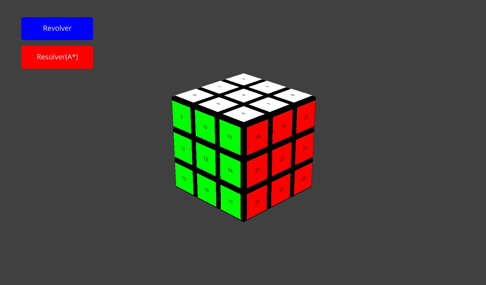

# Cubo de Rubik 3D implementando algoritmo A* para su resolución

Este proyecto implementa el algoritmo de búsqueda en árbol **A*** para encontrar la ruta óptima de resolución de un Cubo de Rubik, acompañado de un motor gráfico 3D desarrollado con la librería Ursina.

## Cómo funciona el Algoritmo

El estado del universo matemático se aplanó a un arreglo unidimensional de 54 casillas. 

Cada cara está enumerada con 9 digitos que indican la posición de cada uno de los cubos de acuerdo a la cara en la que se encuentren, esto con la finalidad de realizar de manera más limpia el mapeo de las permutaciones
- U es para el TOP. Cara blanca
- D es para el DOWN. Cara amarilla
- F es para el FRONT. Cara roja
- B es para el BACK. Cara naranja
- L es para el LEFT. Cara verde 
- R es para el RIGHT. Cara azul

La transición de estados se realiza mediante permutaciones cíclicas de los índices, lo que permite generar los "estados hijos" en fracciones de milisegundo sin saturar el procesador.

### La Heurística
El algoritmo utiliza una función heurística admisible calculando la distancia matemática a la meta:
* $f(n) = g(n) + h(n)$
* Se contabilizan las pegatinas fuera de su posición objetivo y se dividen entre 8 para garantizar que el costo nunca sea sobreestimado.

> [!WARNING]  
> # LIMITACIONES

Dado que este proyecto implementa A* puro en su variante de **Búsqueda en Árbol**, el algoritmo no guarda un registro en memoria de los estados previamente visitados.

* **Resolución óptima (1 a 8 giros):** El algoritmo es sumamente rápido y encuentra el camino perfecto explorando una cantidad manejable de nodos.
* **El Límite del Árbol:** Si el cubo se revuelve con más de 10-15 movimientos completamente aleatorios, el programa alcanzará el límite de seguridad establecido de 500,000 nodos explorados. 
